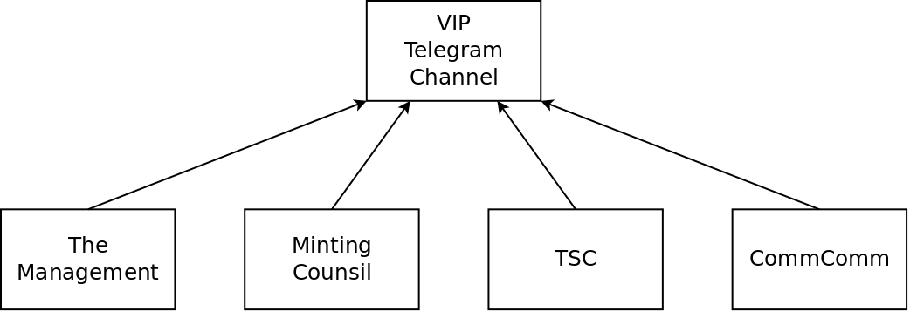

# Governance

The governance structure for the PSF is as horizontal as possible. At the top of the organizational chart is the [VIP Telegram channel](https://t.me/psf_vip). Only members who have demonstrated a sufficient merit are allowed to speak in the room. Merit is based on the number of PSF tokens held by a member, and the length of time they've been held.

The VIP channel is where governance discussion takes place. After sufficient discussion and interest, a voting proposal may be drafted to make serious governance decisions. [Voting proposals](https://psfoundation.cash/proposals) are posted to the PSF website. Voting tokens are air-dropped to the top 50 addresses holding PSF tokens, proportional to their merit. Votes are tallied to achive a 'yes' or 'no' vote on major governance decisions.

There are four sub-committees that are accountable to the members in the VIP channel:
- The Management - A small team of dedicated members who perform administrative tasks.
- The Minting Council - holds the keys used to mint additional PSF tokens into existence.
- The Technical Steering Committee (TSC) - drives the technical goals of the PSF.
- The Community Committee (CommComm) - represents the non-technical members of PSF which are composed of businesses, entrepreneurs, and users.

## Sub-committees

### The Management

The management is currently composed of three members. Their primary function is to maintain the code repositories and websites, and to pay out PSF bounties. They organize and execute voting proposals at the request of members of the VIP channel. They oversee the execution of the results of the voting proposals.

- **Head Janitor** - [Chris Troutner](https://github.com/christroutner) is currently the chairman of the [Technical Steering Committee](#technical-steering-committee-tsc). He manages the agenda and hosts the bi-weekly meetings. He is the largest contributor to the open source code repositories maintained by the PSF.

- **Business Development** - David Allen is an adviser to the PSF and a member of the VIP channel. He occasionally performs business development on behalf of the PSF.

- **Business Administrator** - Our business administrator prefers to remain anonymous. While their identity is a secret, their integrity and professionalism is obvious and appreciated.

### The Minting Council

The minting council is the newest council, and it is still being formed. To be a member of the minting council requires a demonstration of commitment. This will take the form of burning a specified quantity of PSF tokens in exchange for an NFT, issued by the minting council. The NFT acts as a homing-beacon, allowing other members of the minting council to send the holder end-to-end encrypted (ee2e) messages.

Each member of the minting council holds a key to the multisignature wallet that allow minting of additional PSF tokens. The minting council communicates at a minimum of once per quarter to rotate keys. They are the only group with the ability to bring new tokens into existence, and they only do so at the direction of the VIP channel, after the passing of a voting proposal.

### Technical Steering Committee (TSC)

The [Technical Steering Committee](https://github.com/Permissionless-Software-Foundation/TSC) meets every two weeks on Wednesdays at 4 PM UST. They meet via Zoom and the meetings are recorded to the [PSF YouTube channel](https://www.youtube.com/channel/UCQ57IDXJJSYXHBLpF1tBD0g). Agendas are filed as [GitHub Issues](https://github.com/Permissionless-Software-Foundation/TSC/issues). Meetings are announced in the [PSF Telegram channel](https://t.me/permissionless_software). Ask for an invite before joining.

### Community Committee (CommComm)

The [Community Committee](https://github.com/Permissionless-Software-Foundation/community-committee) (CommComm) is currently 'on hold' as the PSF looks for another member (or members) to host the meeting. The goal of the CommComm is to represent the non-technical businesses, entrepreneurs, and users. The CommComm handles marketing related activities and looks for opportunities to develop profitable synergy between the PSF members.

## Governance Documents

- [Contribution Guide](https://github.com/Permissionless-Software-Foundation/TSC/blob/master/CONTRIBUTING.md)
- [Code of Conduct](https://github.com/Permissionless-Software-Foundation/community-committee/blob/master/code-of-conduct.md)
- [Moderation Policy](https://github.com/Permissionless-Software-Foundation/community-committee/blob/master/moderation-policy.md)

### Software License

The PSF uses the [GPL v2 License](https://psfoundation.cash) (the same as Linux) for our 'core' infrastructure software. [MIT license](https://psfoundaition.cash) is used for all other software, like application examples. The goal is to ensure everyone is free to hack-on, share, and expand our software. The goal is to encourage the growth of cryptocurrency and all it's freedom-enhancing promise.
