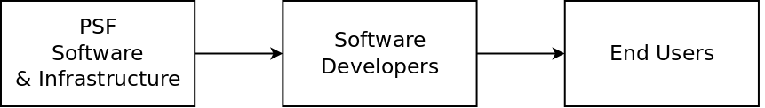

# Introduction

The [Permissionless Software Foundation](https://psfoundation.cash) (**PSF**) is a community of JavaScript developers, entrepreneurs, and businesses. We develop and maintain business-focused cryptocurrency applications and communication software, based on the [The Cash Stack](https://cashstack.info). Some of our software consumes PSF tokens during operation, which allows us to maintain a circular economy with our open source contributors.

**We primarily communicate on [this Telegram channel](https://t.me/permissionless_software). Join us there!**

## Our Mission

The mission of the PSF is to help individuals protect their privacy, circumvent censorship, and engage in economic activity. The software we build and maintain is in service to that mission.

Our suite of software focuses on the following use cases:
- censorship-resistant money
- censorship-resistant networking
- censorship-resistant resource sharing
- censorship-resistant file hosting
- end-to-end encrypted (E2EE) messaging
- token creation and management
- decentralized exchange (DEX) for buying and selling tokens

By the PSF maintaining these primitive features, it empowers entrepreneurs to focus on software specific for their business, while leveraging these features.

## Open Source

The PSF's approach to open source software is greatly influenced by:
- [Working in Public](https://amzn.to/3MvMXm1) by Nadia Eghbal
- [Healthy Open Source](https://medium.com/the-node-js-collection/healthy-open-source-967fa8be7951) by Mikeal Rogers.

The PSF focuses its efforts on *developers* and not *end users*. The pipeline of software production looks like this:

The PSF builds *infrastructure* for developers, and will occasionally produce apps like [wallet.fullstack.cash](https://bchn-wallet.fullstack.cash) or [dex.fullstack.cash](https://dex.fullstack.cash) to *inspire* developers, but these are not intended to be complete products for *end-users*.

Many non-developers who try to consume PSF software become disappointed and are quick to suggest feature improvements, then are further disappointed when their suggestions get little attention. This section exists to set appropriate expectations.

The PSFs intention is for infrastructure, [specifications](https://github.com/Permissionless-Software-Foundation/specifications), and demo apps produced by the PSF to serve as an inspiration to the developers and entrepreneurs who make up the PSF community. They are the ones who are expected to take the software to the next level, to create and manage a pleasant (and profitable) end-user experience.

## About This Site

This website is open source, living documentation that any member of the PSF is welcome to edit by submitting a Pull Request to the [documentation repository](https://github.com/Permissionless-Software-Foundation/psfoundation.info). It describes the purpose and operation of the Permissionless Software Foundation. This documentation will evolve as the organization evolves.

This documentation is where members go to read the nitty-gritty details about the PSF:
- Tokenomics
- Governance Structure
- Communication Tools
- Our Approach to Open Source Software
