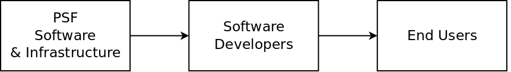

# Open Source

The PSF's approach to open source software is greatly influenced by [Working in Public](https://psfoundation.cash) by Nadia Ehgbal. The PSF focuses its efforts on *developers* and not *end users*. The pipeline of software production looks like this:

The PSF builds *infrastructure* for developers, and will occasionally produce apps like [demo-wallet.fullstack.cash](https://demo-wallet.fullstack.cash) or [dex.fullstack.cash](https://dex.fullstack.cash) to *inspire* developers, but these are not intended to be complete products for *end-users*.

Many non-developers who try to consume PSF software become disappointed and are quick to suggest feature improvements, then are further disappointed when their suggestions get little attention. This page exists to set appropriate expectations.

The PSFs intention is for infrastructure, specifications, and demo apps produced by the PSF to serve as an inspiration to the developers and entrepreneurs who make up the PSF community. They are the ones who are expected to take the software to the next level, to create and manage a pleasant end-user experience.

## Contribution Policy

The PSF follows a *liberal contribution policy* modeled after the Node.js Foundation, and described in [Healthy Open Source](https://medium.com). Contributors who 'land' a Pull Request (PR) to one of our GitHub repositories is automatically invited to be part of the PSF GitHub group. They are then welcome to create branches and approve PRs from other contributors.

Software developers are encouraged to maintain their own fork of PSF software, so that approval of a PR does not become a bottleneck to their own progress. Pull Requests can sit for a very long time before they are reviewed, rejected, or merged. 100% unit test coverage is a goal of all PSF repositories, and so code submissions will frequently sit for long periods of time until they also include unit tests.
