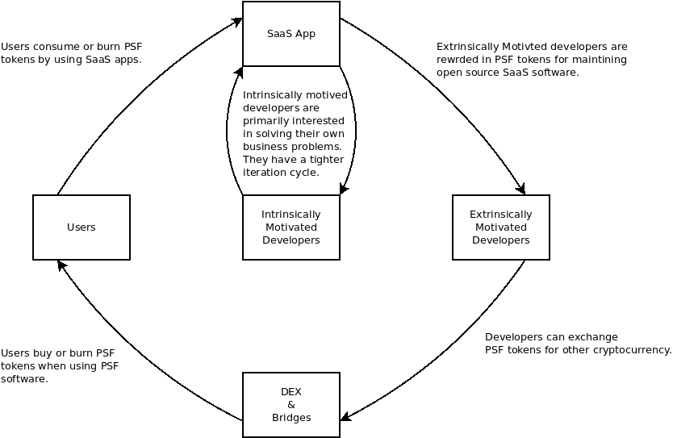

# Tokenomics

The PSF token is issued primarily on the Bitcoin Cash (BCH) blockchain, using the Simple Ledger Protocol (SLP) for tokens. The Token ID below is linked to token information, including the current number of tokens in circulation:

- [38e97c5d7d3585a2cbf3f9580c82ca33985f9cb0845d4dcce220cb709f9538b0](https://token.fullstack.cash/?tokenid=38e97c5d7d3585a2cbf3f9580c82ca33985f9cb0845d4dcce220cb709f9538b0)

There are currently plans to issue the PSF token on the eCash blockchain as well, but it has not yet been issued.

The [Minting Council](/docs/governance#the-minting-council) holds the minting baton, which controls the ability to mint new PSF tokens into existence. The baton is held in a multisignature wallet, and each member of the Minting Council holds a key. They only communicate using encrypted messages passed over the Bitcoin Cash blockchain.

## Token Liquidity and Peg

The PSF token is loosely pegged to the value of Bitcoin Cash (BCH). The price of the PSF token (in BCH) is determined by an equation enforced by the [token-liquidity app](https://github.com/Permissionless-Software-Foundation/token-liquidity), which can be interacted with at [PSFoundation.cash](https://psfoundation.cash), in order to buy and sell PSF tokens.

The token-liquidity app maintains its own wallet, containing both BCH and PSF tokens. The token-liquidity app is known as an 'automated market maker'. It's akin to a vending machine that will trade PSF tokens in exchange for BCH according to a predefined equation. In this way, the app provides perfect liquidity between BCH and the PSF token, and the PSF is 'backed' by the BCH in the apps wallet.

The token-liquidity app is currently the best way to obtain PSF tokens to participate in governance, or to interact with PSF software that charges fees in PSF tokens. But this app will eventually be phased out in favor of [dex.fullstack.cash](https://dex.fullstack.cash) as described in [the Roadmap](/docs/roadmap).

## The 'Nuclear' Option

A 'catastrophic loss' of the token can take many forms. Here are a few examples:
- The minting baton is accidentally destroyed, eliminating the ability to bring new tokens into existence.
- Token technology changes so drastically that the PSF needs to move away from the current token.
- A schism develops in the PSF membership, causing the organization to split into two.
- A number of Minting Council members conspire to inflate and embezzle PSF tokens.
- A State actor arrests PSF members and actively tries to shut down the organization.

Any imaginable catastrophic loss can be mitigated through the creation of a new token. Because the PSF runs entirely on open source software, anyone in the world has the ability to fork the code and modify it to work with a different token. The new token can then be air-dropped to all addresses holding the old token. This is affectionately referred to as 'the nuclear option'.   

The value of the PSF resides in its community, its mission, and the network effect of its users. The token is simply a coordination tool. Like any good tool, it can be upgraded and modified.

## Token Economics

[Working in Public](https://amzn.to/3MvMXm1) makes a careful distinction between *intrinsically* motivated (creativity) and *extrinsically* motivated (money) software developers. In reality, these two motivations are blended together, but the token economics are best explained by looking at them separately.

The diagram below shows two workflows. *Intrinsically motivated developers* have a small loop, which means they can iterate very quickly. Intrinsically motivated developers work on the code for their own reasons. They may be an entrepreneur working on their own idea, they might be paid by a company with a culture of giving back, they may simply be exploring creatively, or they may be doing it for educational purposes. These developers submit Pull Requests (PRs) as a way to give back to the community. Intrinsically motivated developers have always been the primary driver of open source software.

*Extrinsically motivated developers* have a larger loop, and this is where the PSF token plays a role. Many parts of open source software require extrinsic motivation. They aren't fun. They are quite boring. It's a job. This type of work is usually associated with unit tests, documentation writing, reviewing bug reports, and other *maintenance* activity. The need for extrinsic motivation is where many open source projects suffer from a lack of funding.

These two development workflows operate independently, but they can be thought of as two flywheels that are loosely coupled. They are allowed to spin independently, but as one spins up, it spins up the other one too. Every iteration cycle (each trip round the loop) improves the software, increases value, monetizes value, and invests that value back into itself.

### Additional Reading:
If you'd like to dig deeper into the theory and design of the PSF token economics, see these additional resources:

- [token-liquidity developer documentation](https://github.com/Permissionless-Software-Foundation/token-liquidity/tree/master/docs)
- [DEX documentation](https://bch-dex-docs.fullstack.cash/)
- [Healthy Bitcoin](https://psfoundation.cash/blog/healthy-bitcoin)
- [What is the PSF?](https://christroutner.github.io/trouts-blog/blog/what-is-psf)
- [Product vs Project](https://christroutner.github.io/trouts-blog/blog/product-vs-project)
- [Freedom, Softwre, and Token Economics; A Short Story](https://christroutner.github.io/trouts-blog/blog/freedom-software-token-economic-short-story)
